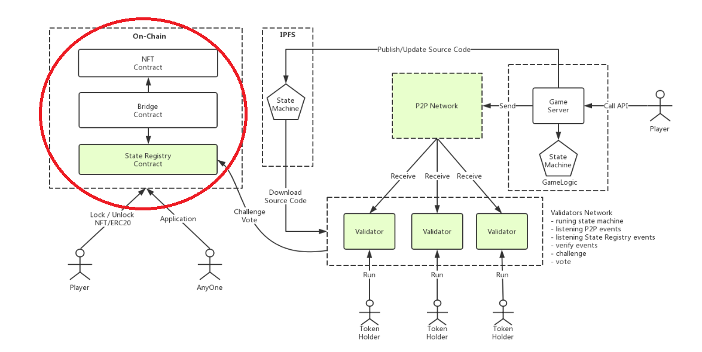

# Rocket Protocol 智能合约开发需求

Layer2 解决方案 Rocket Protocol 是一个通用的解决方案，State Registry + Validators Network + State Machine 规范定义了通用的框架。

游戏开发商在这基础之上只需实现两样内容便能快速的享受 Rocket Protocol 带来的优势：

* 锁定和解锁数字资产的 Bridge 合约
* 提供 Game Server 并在 State Machine 实现游戏逻辑

架构图：



## 合约介绍


> NFT contract

该系统需要发行一个 oep4 通证，用于激励和惩罚机制。

> Bridge contract

智能合约，用于锁定解锁、更新数字资产。
举例：当玩家决定玩一个游戏（如云斗龙的竞技场、龙堡战争）时，需要将 Token 在 Bridge 合约中锁定，然后可以在链下的玩法中尽情使用。当玩家想要退出游戏时，从 Bridge 合约取回 Token，同时如果该 Token 有属性变化，则会更新到 Token 合约中。

> State Registry contract

智能合约，基于代币精选注册表（TCR）扩展而来，用于安全的存储游戏在链下执行的状态（数据）。
任何人都可以申请将链下游戏中计算出来的数据写回链上，但后文讲述的验证人网络会保障正确的数据才会被存储到合约中。
当玩家解锁拿回自己数字资产的时候，通过读取 State Registry 中的数据来进行更新。

当任何人申请将数据写入 State Registry 时需要质押一定的 Token 并同时进入一个等待期，如果验证人网络发现有人写入错误的数据，将发起挑战。随后将进入投票阶段，验证人网络中的节点或 Token 持有者将对结果进行投票。投票结束后，胜利者将拿走失败者质押的 Token。

状态注册合约存储state machine的状态和处理状态变更请求，具有大量的API，但在这里我们只关注与运营商（即游戏开发者）特别相关的功能和事件。


## 合约功能实现

链上部分需要完成4本合约，合约中使用的lib参考[Zeppelin](https://github.com/OpenZeppelin/openzeppelin-solidity/tree/master/contracts)：

1. 实现 oep4 合约
2. 实现 PLCR Voting
3. 实现 Parameterizer 合约 
4. 实现 state registry 合约

### 1. 实现 oep4 合约

该系统需要发行一个 oep4 通证，用于激励和惩罚机制。

### 2. 实现 PLCR Voting

PLCR Voting全称是Partial-Lock-Commit-Reveal Voting。

* PLCR投票是以太坊区块链上的令牌加权投票的有效系统

* PLCR投票使用户能够与其令牌同时参与多个民意调查，同时防止在民意调查中对令牌进行双重投票。

* PLCR投票允许用户（在任何时间）撤回未在投票中主动使用的最大令牌数。

* PLCR投票（在其当前的实施中）不包括令牌 - 在投票的败诉方投票不会导致丢失一个令牌。

参考合约地址： https://github.com/ConsenSys/PLCRVoting


合约事件
```solidity
event _VoteCommitted(uint indexed pollID, uint numTokens, address indexed voter);
event _VoteRevealed(uint indexed pollID, uint numTokens, uint votesFor, uint votesAgainst, uint indexed choice, address indexed voter, uint salt);
event _PollCreated(uint voteQuorum, uint commitEndDate, uint revealEndDate, uint indexed pollID, address indexed creator);
event _VotingRightsGranted(uint numTokens, address indexed voter);
event _VotingRightsWithdrawn(uint numTokens, address indexed voter);
event _TokensRescued(uint indexed pollID, address indexed voter);
```

合约函数
```solidity
function init(address _token) public
function requestVotingRights(uint _numTokens) public
function withdrawVotingRights(uint _numTokens) external
function rescueTokens(uint _pollID) public
function rescueTokensInMultiplePolls(uint[] _pollIDs) public
function commitVote(uint _pollID, bytes32 _secretHash, uint _numTokens, uint _prevPollID) public
function commitVotes(uint[] _pollIDs, bytes32[] _secretHashes, uint[] _numsTokens, uint[] _prevPollIDs) external
function validPosition(uint _prevID, uint _nextID, address _voter, uint _numTokens) public constant returns (bool valid)
function revealVote(uint _pollID, uint _voteOption, uint _salt) public
function revealVotes(uint[] _pollIDs, uint[] _voteOptions, uint[] _salts) external
function getNumPassingTokens(address _voter, uint _pollID) public constant returns (uint correctVotes)
function startPoll(uint _voteQuorum, uint _commitDuration, uint _revealDuration) public returns (uint pollID)
function getTotalNumberOfTokensForWinningOption(uint _pollID) constant public returns (uint numTokens)
function commitPeriodActive(uint _pollID) constant public returns (bool active)
function revealPeriodActive(uint _pollID) constant public returns (bool active)
function didCommit(address _voter, uint _pollID) constant public returns (bool committed)
function didReveal(address _voter, uint _pollID) constant public returns (bool revealed)
function pollExists(uint _pollID) constant public returns (bool exists) 
function getCommitHash(address _voter, uint _pollID) constant public returns (bytes32 commitHash)
function getNumTokens(address _voter, uint _pollID) constant public returns (uint numTokens)
function getLastNode(address _voter) constant public returns (uint pollID) 
function getLockedTokens(address _voter) constant public returns (uint numTokens)
function getInsertPointForNumTokens(address _voter, uint _numTokens, uint _pollID) constant public returns (uint prevNode)
function isExpired(uint _terminationDate) constant public returns (bool expired)
function attrUUID(address _user, uint _pollID) public pure returns (bytes32 UUID)

```


### 3. 实现Parameterizer合约

是PLCR合约的参数配置合约，该合约会调用PLCRVoting和Oep4合约。

```solidity
// Global Variables
EIP20Interface public token;
PLCRVoting public voting;
```
    
合约事件：
```solidity
event _ReparameterizationProposal(string name, uint value, bytes32 propID, uint deposit, uint appEndDate, address indexed proposer);
event _NewChallenge(bytes32 indexed propID, uint challengeID, uint commitEndDate, uint revealEndDate, address indexed challenger);
event _ProposalAccepted(bytes32 indexed propID, string name, uint value);
event _ProposalExpired(bytes32 indexed propID);
event _ChallengeSucceeded(bytes32 indexed propID, uint indexed challengeID, uint rewardPool, uint totalTokens);
event _ChallengeFailed(bytes32 indexed propID, uint indexed challengeID, uint rewardPool, uint totalTokens);
event _RewardClaimed(uint indexed challengeID, uint reward, address indexed voter);
```

合约函数：
```solidity
function init(address _owner,address _token,address _plcr,uint[] _parameters,bytes32 _operator) 
function proposeReparameterization(string _name, uint _value) public onlyOwner returns (bytes32)
function challengeReparameterization(bytes32 _propID) public returns (uint challengeID)
function processProposal(bytes32 _propID) public 
function claimReward(uint _challengeID, uint _salt) public
function claimRewards(uint[] _challengeIDs, uint[] _salts) public 
function voterReward(address _voter, uint _challengeID, uint _salt)public view returns (uint) 
function propExists(bytes32 _propID) view public returns (bool) {
function challengeCanBeResolved(bytes32 _propID) view public returns (bool)
function challengeWinnerReward(uint _challengeID) public view returns (uint) 
function getOperator() public view returns (bytes32 operator)
function tokenClaims(uint _challengeID, address _voter) public view returns (bool)
```

### 4. 实现state registry合约

参数配置合约，该合约会调用Parameterizer、PLCRVoting和Oep4合约。

```solidity
// Global Variables
EIP20Interface public token;
PLCRVoting public voting;
Parameterizer public parameterizer;
```

合约事件
```solidity
event _Application(bytes32 indexed listingHash, uint deposit, uint applyStageLen, uint appEndDate, bytes32 data, address indexed applicant);
event _Challenge(bytes32 indexed listingHash, uint challengeID, bytes32 data, uint commitEndDate, uint revealEndDate, address indexed challenger);
event _Deposit(bytes32 indexed listingHash, uint added, uint newTotal, address indexed owner);
event _Withdrawal(bytes32 indexed listingHash, uint withdrew, uint newTotal, address indexed owner);
event _ApplicationWhitelisted(bytes32 indexed listingHash);
event _ApplicationRemoved(bytes32 indexed listingHash);
event _ListingRemoved(bytes32 indexed listingHash);
event _ListingWithdrawn(bytes32 indexed listingHash);
event _TouchAndRemoved(bytes32 indexed listingHash);
event _ChallengeFailed(bytes32 indexed listingHash, uint indexed challengeID, uint rewardPool, uint totalTokens);
event _ChallengeSucceeded(bytes32 indexed listingHash, uint indexed challengeID, uint rewardPool, uint totalTokens);
event _RewardClaimed(uint indexed challengeID, uint reward, address indexed voter);
```

合约函数
```solidity
function init(address _token, address _voting, address _parameterizer, string _name) public
function apply(bytes32 _listingHash, uint _amount, bytes32 _data) external
function deposit(bytes32 _listingHash, uint _amount) external 
function withdraw(bytes32 _listingHash, uint _amount) external
function exit(bytes32 _listingHash) external
function challenge(bytes32 _listingHash, bytes32 _data) external returns (uint challengeID)
function updateStatus(bytes32 _listingHash) public
function updateStatuses(bytes32[] _listingHashes) public
function claimReward(uint _challengeID, uint _salt) public
function claimRewards(uint[] _challengeIDs, uint[] _salts) public
function voterReward(address _voter, uint _challengeID, uint _salt)public view returns (uint)
function canBeWhitelisted(bytes32 _listingHash) view public returns (bool)
function isWhitelisted(bytes32 _listingHash) view public returns (bool whitelisted)
function getData(bytes32 _listingHash) view public returns (bool exists, bytes32 data)
function appWasMade(bytes32 _listingHash) view public returns (bool exists) 
function challengeExists(bytes32 _listingHash) view public returns (bool)
function challengeCanBeResolved(bytes32 _listingHash) view public returns (bool) 
function determineReward(uint _challengeID) public view returns (uint)
function tokenClaims(uint _challengeID, address _voter) public view returns (bool)
function barrier(bytes32 _listingHash) public view returns (uint256)
function newRegistryBYOToken(EIP20 _token, uint[] _parameters,string _name,bytes32 _operator) public returns (Registry) 
function newRegistryWithToken(uint _supply,string _tokenName,uint8 _decimals,string _symbol,uint[] _parameters,string _registryName,bytes32 _operator) public returns (Registry) {
```


#### 主要函数介绍

##### apply

Submit a state application.

```solidity
function apply(bytes32 _key, uint _amount, string _data)
```

- `key`: a unique identifier that identifies the application.
- `amount`: the amount of tokens to stake for the application. It must be at least as large as `minDeposit` as specified in [the config](./docs/registry-factory-config-example.json). Before calling apply, you need to ensure that you've [approved](https://theethereum.wiki/w/index.php/ERC20_Token_Standard#Approve_And_TransferFrom_Token_Balance) the registry contract to transfer at least `amount` tokens.
- `data`: the value of the application. If the value is large enough that you don't want to store it on the blockchain, you could also store it in IPFS and use an IPFS hash.

It's recommended that the `key` is a `keccak256` hash. For instance, if `data` is a JSON object that looks like:

```json
{
  "matchID": 281975,
  "winnerDragon": 98325720
}
```

Then you could use the hash of `matchID` as the key.

Note that it's recommended that the application is "immutable," meaning that the application refers to a fact at a particular moment in time. For instance, instead of applying "the level of dragon A", it's better to apply "the level of dragon A as of nonce 568927". This is because if you use the former, once the dragon levels up again, the application will cease to be valid and may be successfully challenged, which means you may lose your stake.

##### updateStatus

Once `applyStageLength` seconds (see `registry-factory-config-example.json`) have passed, anyone may call `updateStatus` to confirm the application, i.e. writing it into the registry if it has not been successfully challenged.

Note that without calling this function, the application won't actually be written into the registry. Therefore it's important that someone calls this function.

```solidity
function updateStatus(bytes32 _key)
```

##### getData

Get the data for a application.

```solidity
function getData(bytes32 _key) returns (bool exists, string data)
```

- `key`: the unique identifier for the application.
- `exists`: indicates whether the state application exists. If `exists` is `false`, `data` is an empty string.
- `data`: the value of the application.

##### exit

Remove an entry from the state registry. The staked tokens will be returned to the owner of the entry. Only the owner of the entry can call this function.

```solidity
function exit(bytes32 _key)
```

#### 主要事件介绍

##### Application

```solidity
event _Application(bytes32 indexed key, uint deposit, uint applyStageLen, uint appEndDate, string value, address indexed applicant);
```

This event is emitted when an application has been made.

##### ApplicationWhitelisted

```solidity
event _ApplicationWhitelisted(bytes32 indexed key)
```

This event is emitted when an application (i.e. a application) has been accepted.

#### 配置文件

Here we explain the fields in the config. 
```dtd

{
    "paramDefaults": {
        "minDeposit": 10,
        "pMinDeposit": 100,
        "applyStageLength": 600,
        "pApplyStageLength": 1200,
        "commitStageLength": 600,
        "pCommitStageLength": 1200,
        "revealStageLength": 600,
        "pRevealStageLength": 1200,
        "dispensationPct": 50,
        "pDispensationPct": 50,
        "voteQuorum": 50,
        "pVoteQuorum": 50
    },
    "name": "The TestChain Registry",
    "token": {
        "address": "The address of the token contract. This field only applies if deployToken is set to false",
        "deployToken": true,
        "decimals": "18",
        "name": "TestCoin",
        "symbol": "TEST",
        "supply": "1000000000000000000000000000",
        "tokenHolders": [
            {
                "address": "0x90f8bf6a479f320ead074411a4b0e7944ea8c9c1",
                "amount": "500000000000000000000000000"
            },
            {
                "address": "0xffcf8fdee72ac11b5c542428b35eef5769c409f0",
                "amount": "500000000000000000000000000"
            }
        ]
    },
    "operator": "@vKD9RrhMouOG83IXXavsmt1mBvagCYTy/tHpxacAT1k=.ed25519"
}
```

See [PLCR voting](https://github.com/ConsenSys/PLCRVoting) for what `commit` and `reveal` means.

- `minDeposit`: the minimum amount of tokens that needs to be staked when creating an application.
- `applyStageLength`: the number of seconds that the apply stage lasts. The apply stage starts when `apply` is called. Only during the apply stage can the application be challenged.
- `commitStageLength`: the number of seconds that the reveal stage lasts. The commit stage starts when an application has been challenged. Only during the commit stage can people vote on the application.
- `revealStageLength`: the number of seconds that the reveal stage lasts. The reveal stage starts when the commit stage ends. Only during the reveal stage can people reveal their votes.
- `dispensationPct`: when someone wins a challenge, they will get back their own deposit, plus a sum of tokens equal to the `dispensationPct` of their opponent’s stake.
- `voteQuorum`: the percentage of votes it takes for an application to be considered accepted.

Each of these parameters has a variant starting with `p`, like `minDeposit` and `pMinDeposit`. The `p` variants are for adjusting the parameters themselves. For instance, if `pMinDeposit` is 100, it means that the minimum deposit for submitting an application that changes a parameter is 100.
